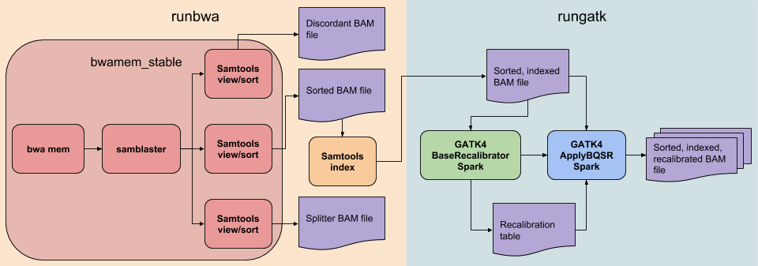

# BioExcel_Align

Python package to run a genome alignment pipeline, based on workflows
defined by IGMM.

## Requirements:

- BWA
- Samblaster
- Samtools
- BioBamBam2 (optional - for beta version of BWA Mem alignment stage)
- GATK4
- Python 3.x

We recommend using the conda package manager, and making use of virtual 
environments. This tool also exists in the bioconda channel. This has the 
benefit of automatically installing all pre-requisites when installing this 
tool.

## Installation

There are two main ways to install the package.

### Conda package installation

#### Set up a new conda environment (optional):

```bash
$ conda create -n my_env -c bioconda python=3 
```

This creates a clean Python3 environment in which to install and run the tool. 
If you have a conda environment you already wish to use, make sure you add the 
bioconda channel to the environment, or your conda package as a whole.

#### Install BioExcel_Align
```bash
$ conda install bioexcel_align
```

This one line will install BioExcel_Align and all of it's dependencies.

### Manual installation

If you wish to install manually, follow the steps below. We still recommend 
using some kind of virtual environment. Before running the workflow, install
the pre-requisite tools and ensure they are contained in your $PATH

```bash
$ git clone https://github.com/bioexcel/BioExcel_Align.git
$ cd BioExcel_Align
$ python setup.py install
```

## Usage

Once installed, there are several ways to use the tool. The easiest is to call
the executable script, which runs the whole workflow based on several options 
and arguments the user can modify. Find these using

```bash
$ bxcl_align -h
```

An example of basic usage of the pipeline is:

```bash
$ bxcl_align --files in1.fq.gz in2.fq.gz --threads 8 
--outdir ./output --sample 'TestAlign' 
--bwa_ind_ref genomes/Hsapiens/GRCh37/bwa/GRCh37.fa 
-r genomes/Hsapiens/GRCh37/seq/GRCh37.fa 
-k genomes/Hsapiens/GRCh37/variation/dbsnp-147.vcf.gz 
-j '-Djava.io.tmpdir=/home/tmp -Xmx64G'
```

### Python Module

In addition to the executable version, the tool is installed as a Python 
package, so each stage can be imported as a module into other scripts, if the 
user wishes to perform more unique/complicated/expanded workflows. Each function
creates and returns a python subprocess.

```python
import bioexcel_align
import bioexcel_align.runbwa as rb
import bioexcel_align.rungatk as rg

# Do things before running BWA Mem/samtools/samblaster alignment command

pbwa = rb.bwamem_stable(bwa_ind_ref, threads, date, sampleID, files, bwadir)
pbwa.wait()

# Do things after BWA Mem, and before GATK4 BQSR stages

pbr = rg.baserecal(jvm_opts, threads, ref, infile, knownsites, gatkdir, sampleID)
pbr.wait()

pab = rg.applybqsr(jvm_opts, threads, infile, gatkdir, sampleID)
pab.wait()

# Do further analysis
```

## Stages

Our pipeline consists of two main stages: runbwa and rungatk. Each stage exists
as a python module as shown above. Each module contains specific functions that 
execute the tools listed. The diagram below shows each of these 
stages and functions, with colour coding to show which tools
are used in each module/function, as well as useful output files. 



Each module can also be executed independently of the main executable workflow. 
For example, if a situation occurs that causes GATK to fail, the rungatk stage
can be executed from the command line as 

```bash
$ python -m bioexcel_align.rungatk <arguments>
```

### bwamem_beta

There is also a more recent, but less tested version of the first stage of the 
pipeline, which replaces samblaster/samtools with the tool bamsormadup 
(available as part of biobambam2). We recommend using this with caution. IGMM
partners suggested this change, but we have encountered some errors when testing
using the [Cirrus](https://cirrus.readthedocs.io/en/latest/) machine as a 
testbed for our workflows. Further effort will be needed to develop this further
and better understand the cause of the errors.